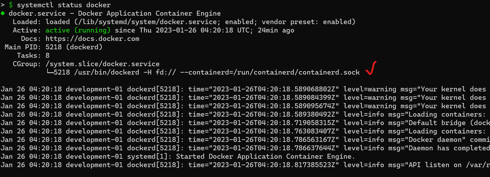

# Setup Kubernetes Cluster with kubeAdm on Ubuntu

## Prerequisite

The setup process will vary depending on the virtualization or cloud environment you’re using. My setup contain two servers with Ubuntu 20.04. One as control plane machine node and the other one as a worker node to be used for running containerized workloads. You can add more nodes to suit your desired use case, load, and HA.

| Role |	Hostname |	Specs |
| --- | --- | --- |
| Controlplane  |	controlplane01.techinet.local  |	4GB Ram, 2vcpus |
| Worker-01  |	worker01.techinet.local  |	4GB Ram, 2vcpus |

## Topology


There are two server types used in deployment of Kubernetes clusters:
- ControlPlane: A Kubernetes ControlPlane is where control API calls for the pods, replications controllers, services, nodes and other components of a Kubernetes cluster are executed.
- Worker: A Worker is a node that provides the run-time environments for all of your apps run in the containers. A set of container pods can span multiple workers.

The minimums:
- Memory: 4 GiB or more of RAM per machine.
- CPUs: At least 2 CPUs on the control plane machine.
- Internet connectivity and internal connectivity between nodes.

## Instructions
Perform all of these commands on each machines. Run as root otherwise specified.

##### Update the OS
Once the servers are ready, update them first.
```
sudo apt -y full-upgrade && sudo reboot
```

##### Disable Firewall
The first thing we should do is check the status of the firewall to see if it’s on or off.
```
sudo ufw status
```
To disable the Ubuntu firewall, execute the following command.
```
sudo ufw disable
```

##### Disable swap
```
sudo sed -i '/ swap / s/^\(.*\)$/#\1/g' /etc/fstab
```
To disable Linux swap space permanently go to '/etc/fstab'. Search for a swap line and add hashtag(#) sign in front of the line.
```
#/swap.img	none	swap	sw	0	0
```
If you can't find that line on fstab file it means your system does not use swap already. Now, confirm setting is correct.
```
sudo swapoff -a
sudo mount -a
free -h
```

### Enable kernel modules
```
sudo modprobe overlay
sudo modprobe br_netfilter
```

##### Update sysctl settings for Kubernetes networking
```
sudo tee /etc/sysctl.d/kubernetes.conf<<EOF
net.bridge.bridge-nf-call-ip6tables = 1
net.bridge.bridge-nf-call-iptables = 1
net.ipv4.ip_forward = 1
EOF
```
Reload sysctl
```
sudo sysctl --system
```

### Install docker engine
In this guide I will install docker package and containerd.io as my runtime. You could install other container runtime if you like. However, to run containers in Pods, Kubernetes supported container runtimes are:

| Runtime |	Path to Unix domain socket |
| --- | --- |
| Containerd | unix:///run/containerd/containerd.sock |
| CRI-O |	unix:///var/run/crio/crio.sock  |
| Docker Engine |	unix:///run/cri-dockerd.sock |
| Mirantis Container Runtime |	Check the systemd unit named cri-docker.socket to find out the path to the CRI socket  |


##### Add docker repository
```
sudo apt update -y && sudo apt install -y curl gnupg2 software-properties-common apt-transport-https ca-certificates
curl -fsSL https://download.docker.com/linux/ubuntu/gpg | sudo apt-key add -
sudo add-apt-repository "deb [arch=amd64] https://download.docker.com/linux/ubuntu $(lsb_release -cs) stable"
```

##### Install docker
```
sudo apt update -y && sudo apt install -y containerd.io docker-ce docker-ce-cli

sudo systemctl daemon-reload && sudo systemctl restart docker && sudo systemctl enable docker
```

### KubeAdm Setup
##### Add kubelet, kubeadm and kubectl repository
Once the servers are rebooted, add Kubernetes repository for Ubuntu 20.04 to each servers.
```
curl -s https://packages.cloud.google.com/apt/doc/apt-key.gpg | sudo apt-key add -
echo "deb https://apt.kubernetes.io/ kubernetes-xenial main" | sudo tee /etc/apt/sources.list.d/kubernetes.list
```
##### Install Kubernetes components
```
sudo apt update -y && sudo apt -y install kubelet kubeadm kubectl

sudo apt-mark hold kubelet kubeadm kubectl
```
##### Confirm installation
```
kubectl version --short --output=yaml && kubeadm version
```

## On Controlplane Node

##### Checking location of container runtime socket


##### Initialize Kubernetes Cluster
```
sudo kubeadm init --pod-network-cidr=10.138.16.0/16 --service-cidr=10.138.32.0/16 --control-plane-endpoint="<your-endpoint-ip-or-dns>:<port>"--cri-socket=unix:///run/containerd/containerd.sock
```

##### To be able to run kubectl commands as non-root user
If you want to be able to run kubectl commands as non-root user, then as a non-root user perform these
```
mkdir -p $HOME/.kube
sudo cp -i /etc/kubernetes/admin.conf $HOME/.kube/config
sudo chown $(id -u):$(id -g) $HOME/.kube/config

```
##### Deploy Calico network
```
kubectl create -f https://docs.projectcalico.org/manifests/calico-typha.yaml
```
##### Cluster join command
```
kubeadm token create --print-join-command
```

The output would generate a command for worker node join k8s cluster like example below. Copy that command and execute on worker node.


##### NOTE [Optional] 
If you experience where kubeadm could not find to cri path you could add "--cri-socket" flags manually like we have done on controlplane node when we initialize kubeadm.
```
sudo kubeadm join 10.138.0.9:6443 --token h589k6.078s0su5k32boq6f --discovery-token-ca-cert-hash sha256:05c4b5b144e6d58c7b08cacb815b47a88c053c94fa22e6270e5eedef07fcd796 --cri-socket="unix:///run/containerd/containerd.sock"
```

## On Worker Node
##### Join the cluster
Use the output from __kubeadm token create__ command in previous step from the master server and run here.

## Verifying the cluster
##### Get Nodes status
```
kubectl get nodes
```
##### Get component status
```
kubectl get cs
```
